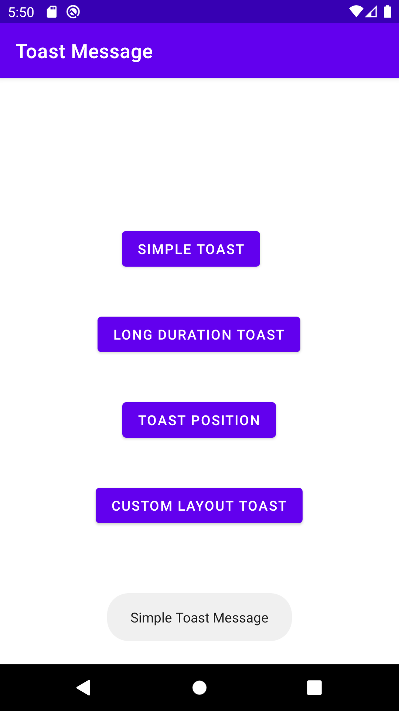

# Android Java Toast Message

## Toasts overview :

<p>A toast provides simple feedback about an operation in a small popup. It only fills the amount of space required for the message and the current activity remains visible and interactive. Toasts automatically disappear after a timeout.</p>


## Create and Show Toast :

<ul>
<li>First create a <b>Toast object</b></li>

```java
    Toast toast =
```
<li> Then create a toast message to use the <b>makeText()</b> method, which takes the following parameters:</li>
<ol>
<li>The application Context</l>
<li>The text that should appear to the user.</l>
<li>The duration that the toast should remain on the screen.</l>
</ol>

```java
    Toast toast = Toast.makeText(getApplicationContext(), "Simple Toast Message", Toast.LENGTH_SHORT);
```
<li>And the last to display toast message in screen call th <b>show()</b> function</li>

```java
    toast.show();
```
</ul>
