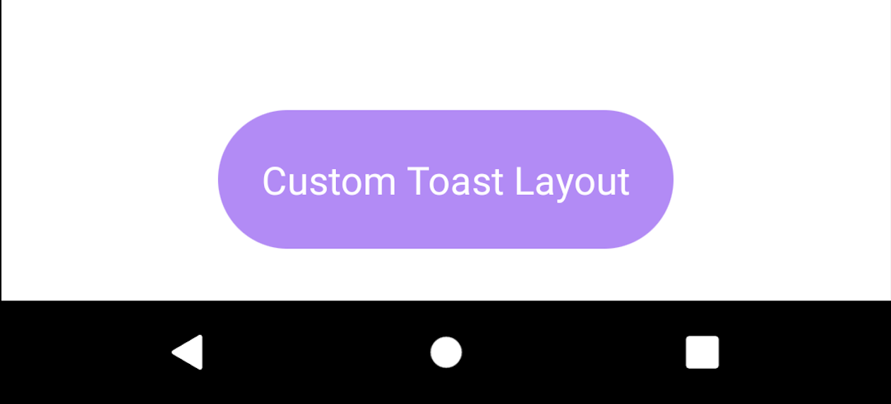

# Android Java Toast Message

## Toasts overview :

<p>A toast provides simple feedback about an operation in a small popup. It only fills the amount of space required for the message and the current activity remains visible and interactive. Toasts automatically disappear after a timeout.</p>


## Create and Show Toast :

<ul>
<li>First create a <b>Toast object</b></li>

```java
Toast toast =
```

<li> Then create a toast message, use the <b>makeText()</b> method which takes the following parameters:</li>

<ol>
<li>The application Context</l>
<li>The text that should appear to the user.</l>
<li>The duration that the toast should remain on the screen.</l>
</ol>

```java
Toast toast = Toast.makeText(getApplicationContext(), "Simple Toast Message", Toast.LENGTH_SHORT);
```

<li>And the last to display toast message in screen call the <b>show()</b> function</li>

```java
toast.show();
```
</ul>

## Chain your toast method calls :

<p>You can chain your methods to avoid holding on to the Toast object, as shown in the following code snippet:</p>

```java
Toast.makeText(getApplicationContext(), "Toast with java method chaining", Toast.LENGTH_SHORT).show();
```

## Constants of Toast class (duration):

<p>There are only 2 constants of Toast class which are given below.<p>
<p>1. <b>LENGTH_LONG</b> : displays toast message view for the long duration of time.</p>
<p>2. <b>LENGTH_SHORT</b> : displays toast message view for the short duration of time.</p>

## Toast Display Position :

<p>A standard toast notification appears near the bottom of the screen, centered horizontally. You can change this position with the
<b>setGravity(int, int, int)</b> method. This accepts three parameters: a  <b>Gravity constant, an x-position offset, and a y-position offset.</b></p>
<p>For example, if you decide that the toast should appear in the top-left corner, you can set the gravity like this:</p>

```java
toast.setGravity(Gravity.TOP|Gravity.LEFT, 0, 0);
```
## Creating a Custom Toast View :
<ol>
<li>To create a custom toast view, you need to create a custom layout file in XML(custom_toast.xml) and pass the root View object to the <b>setView(View)</b> method.</li>

```xml
<?xml version="1.0" encoding="utf-8"?>
<androidx.constraintlayout.widget.ConstraintLayout xmlns:android="http://schemas.android.com/apk/res/android"
    xmlns:app="http://schemas.android.com/apk/res-auto"
    xmlns:tools="http://schemas.android.com/tools"
    android:layout_width="match_parent"
    android:layout_height="match_parent"
    android:id="@+id/customtoast"
    android:background="@drawable/custom_toast_shape">


    <TextView
        android:id="@+id/textView"
        android:layout_width="wrap_content"
        android:layout_height="wrap_content"
        android:text="Custom Toast Layout"
        android:textColor="#FFF"
        android:textSize="18sp"
        app:layout_constraintBottom_toBottomOf="parent"
        app:layout_constraintEnd_toEndOf="parent"
        app:layout_constraintHorizontal_bias="0.498"
        app:layout_constraintStart_toStartOf="parent"
        app:layout_constraintTop_toTopOf="parent"
        tools:ignore="MissingConstraints"
        android:layout_margin="20dp"/>
</androidx.constraintlayout.widget.ConstraintLayout>
```

<li>And if you want to create a custom toast shape then you need to create a new shape XML(custom_toast_shape.xml) also</li>

```xml
<?xml version="1.0" encoding="UTF-8"?>
<shape xmlns:android="http://schemas.android.com/apk/res/android">
    <solid android:color="@color/purple_200"/>
    <corners android:radius="100dp" />
</shape>
```

<li>Then, retrieve the <b>LayoutInflater with getLayoutInflater()</b> and then inflate the layout from XML using <b>inflate(int, ViewGroup)</b>. The first parameter is the <b>layout resource ID</b> and the second is the </b>root View</b>.
You can use this inflated layout to find more View objects in the layout, so now capture and define the content for the ImageView and TextView elements. Finally, create a new Toast with Toast(Context) and set some properties of the toast,
such as the gravity and duration. Then call <b>setView(View)</b> and pass it the <b>inflated layout</b>. You can now display the toast with your custom layout by <b>calling show()</b>.</li>

```java
//Creating the LayoutInflater instance
LayoutInflater li = getLayoutInflater();
//Getting the View object as defined in the custom_toast.xml file
View layout = li.inflate(R.layout.custom_toast,(ViewGroup) findViewById(R.id.customtoast));

btn4.setOnClickListener(view -> {
    Toast toast = Toast.makeText(getApplicationContext(), "Set Toast Position", Toast.LENGTH_SHORT);
    toast.setView(layout);
    toast.show();
 });
```
</ol>




